# Federal Spending Methodology

> **Research question:** How much money is the federal government giving to city governments?

## Overview

The goal of this pipeline is to obtain detailed federal spending data to understand how much the federal government is awarding to various city governments over time.

Once this question is answered, additional questions can be explored:

- How much federal funding is being spent by non-government entities in cities?
- How are cities the same and different when we look discretely at spending data?
  - Which agencies are spending the most in each city?

The DATA Act makes mandatory and standardizes the monthly self-reporting of all federal moneys spent by each entity that may receive them, and mandates that said data be made public. This pipeline uses [USASpending.gov](https://usaspending.gov), which was built in response to these mandates and facilitates access to federal spending data.

> **In brief:** Transaction-level data for all prime awards since 2017 are obtained, filtered using the UEIs of local government entities with recipient addresses that sit within the geographical bounds of each US Census-defined Incorporated Place, and summarized as total federal spending per city per fiscal year.
>
> Later, this value can be normalized to reflect total spending per 100k residents per fiscal year such that spending data may be appropriately compared across cities.

The primary output is a graph of spending vs. time for each city:

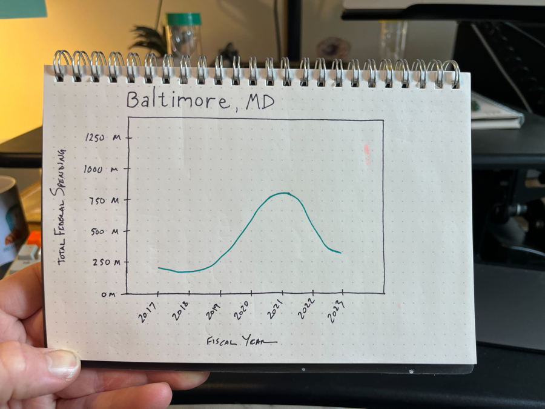

This document outlines the steps necessary to produce this output:

1. [Collect the appropriate federal spending data from USA Spending](#step-1-collect-data-from-usa-spending)
2. [Identify the set of recipients that represent the "city governments" of each Incorporated Place](#step-2-identify-recipients)
3. [Collect and filter all transactions associated with these recipients, and summarize them for each city for each fiscal year](#step-3-collect-transactions)

---

## Configuration

### Directory structure

All paths listed in this document and R scripts are defined relative to the parent `city-federal-spending` repo root.

```
city-federal-spending/
├── awardsreport/          # awardsreport submodule
├── data-delivery/         # output files for downstream use
├── data-helpers/          # crosswalks and reference files
├── data-processed/        # intermediate data saved throughout workflow
│   └── plots/             # city geography+recipient maps and spending charts
├── data-raw/              # raw data from external sources
├── methodology/           # this document and supporting assets
└── r-delivery/            # R scripts for running the full pipeline
```

### Files to check for updates upon re-running

1. **[SAM.gov entity registration file](https://sam.gov/data-services/Entity%20Registration/Public%20V2?privacy=Public)**
   - Contains all entities registered with SAM.gov, which defines the UEI (unique entity identifier) of each recipient — the key used to link geographies and spending data.
   - Download the latest monthly Public V2 extract from SAM.gov (requires a SAM.gov account). Place in `./data-raw/` and update `file_sam_gov` in `spending-config.R`.

2. **[ZCTA5 to Incorporated Places Crosswalk](https://www.census.gov/geographies/reference-files/time-series/geo/relationship-files.2020.html#zcta)**
   - Updated with each census release, this file contains all ZCTA5 codes that intersect Census Places.
   - Represents the relationship as of the 2020 Census. Update as necessary.
   - A local copy is stored at `./data-raw/tab20_zcta520_place20_natl.txt`. An explanation file is at `./data-helpers/explanation_tab20_zcta520_place20_natl.pdf`.

### A note on the code

All R code in this document illustrates the general steps taken to obtain and process the data. It is a reference for understanding, not verbatim execution.

The specific scripts used to do the work may look slightly different in organization or flow, and the code listed here will not be updated or maintained. The R scripts in `./r-delivery/` should be used when replicating this workflow.

---

## Step 1: Collect Data from USA Spending

### Overview

Spending data is available for perusal, filtering, and download at [USASpending.gov](https://usaspending.gov). An [API is also available](https://api.usaspending.gov/) for more discretized data collection. Neither the GUI nor API, however, allows for seamless programmatic access to transaction-level data at the scale required here.

After assessing the feasibility of using these tools, the approach settled on was to use the [awardsreport](https://github.com/govex/awardsreport) endpoint — a Python FastAPI tool that seeds local PostgreSQL databases with USA Spending transaction data. See that repo for its original documentation.

The general approach:
1. Create local PostgreSQL databases (one per year)
2. Use the awardsreport endpoint to populate them with transactions from USA Spending
3. Connect to the databases from R and query them directly

### Creating a local PostgreSQL DB

The following uses [conda](https://docs.conda.io/projects/conda/en/latest/user-guide/index.html) to install and run PostgreSQL locally without admin rights.

<details>
<summary>Reference: Install and start PostgreSQL in conda locally</summary>

```bash
# Create conda environment
conda create --name myenv
conda activate myenv

# Install postgresql via conda
conda install -y -c conda-forge postgresql

# Create a base database locally
initdb -D mylocal_db

# Start the server
pg_ctl -D mylocal_db -l logfile start

# Create a non-superuser
createuser --encrypted --pwprompt mynonsuperuser

# Create an inner database inside the base database
createdb --owner=mynonsuperuser myinner_db
```

</details>

For this pipeline, the conda env is called `awardsreport`. The base DB is called `awardsreport_db`. A separate inner DB is created for each fiscal year (2017–2023), named `ar_db_17` through `ar_db_23`.

[pgAdmin](https://www.pgadmin.org/) can be used to verify that command-line actions are being reflected in postgres.

### Populating the DB via the AwardsReport endpoint

<details>
<summary>AwardsReport repo overview and setup instructions</summary>

**Repo:** [govex/awardsreport](https://github.com/govex/awardsreport)

The USAspending Monthly Awards Report uses federal prime award transaction data from USAspending.gov to provide information on the top categories receiving spending by various elements for each month.

**Requires:** Python 3.10, PostgreSQL

**Setup:**
1. Install requirements: `pip install -r requirements.txt` and `pip install .`
2. Create a psql database
3. Set database information: `mv .env.example .env`, update values in `.env`
4. Run alembic migrations: `alembic upgrade head`
5. Seed the database with raw data: `python src/awardsreport/setup/seed.py`
6. Run derivations: `python src/awardsreport/setup/transaction_derivations.py`
7. Insert records to `transactions` table: `python src/awardsreport/setup/seed_transactions_table.py`
8. Optionally run the server on localhost: `python src/awardsreport/main.py`

</details>

### Full database construction workflow

1. [Download and install Anaconda](https://www.anaconda.com/download/) and activate:
   ```bash
   source <path-to-Anaconda>/bin/activate
   conda init --all
   ```

2. Create and activate the `awardsreport` environment:
   ```bash
   conda create -n awardsreport python=3.10
   conda activate awardsreport
   ```

3. Install PostgreSQL via conda:
   ```bash
   conda install -y -c conda-forge postgresql
   ```

4. Install requirements inside the awardsreport repo:
   ```bash
   cd awardsreport/awardsreport
   pip install -r requirements.txt
   pip install .
   ```

5. Create the base database and start the server:
   ```bash
   initdb -D awardsreport_db
   pg_ctl -D awardsreport_db -l logfile start
   ```

6. Create a non-superuser:
   ```bash
   createuser --encrypted --pwprompt <your_db_user>
   ```

7. Create an inner database for each year:
   ```bash
   createdb --owner=<your_db_user> ar_db_17
   createdb --owner=<your_db_user> ar_db_18
   createdb --owner=<your_db_user> ar_db_19
   createdb --owner=<your_db_user> ar_db_20
   createdb --owner=<your_db_user> ar_db_21
   createdb --owner=<your_db_user> ar_db_22
   createdb --owner=<your_db_user> ar_db_23
   ```

8. For each year, perform the following steps:
   1. Set the target DB in `.env`:
      ```
      DB_DATABASE="ar_db_XX"   # where XX is the two-digit year
      ```
   2. Run migrations: `alembic upgrade head`
   3. Seed the database:
      ```bash
      python src/awardsreport/setup/seed.py --no_months 12 --year 20XX --month 9
      ```
      > **Note on the seed command:** `--no_months 12` requests 12 months of data; `--month 9` (November) and `--year 20XX` define the end point, so the call collects the full federal fiscal year (Oct–Sep). This step can take over 1 hour per year.
   4. Run derivations: `python src/awardsreport/setup/transaction_derivations.py`
   5. Seed transactions table: `python src/awardsreport/setup/seed_transactions_table.py`

9. Since we query the postgres DBs directly from R, running the API server is not necessary.

### Connecting to postgres databases in R

Make sure the outer database is running in terminal before connecting from R:

```bash
pg_ctl -D awardsreport_db -l logfile start
```

Connecting to each DB and obtaining access for SQL queries in R uses a chain of libraries:

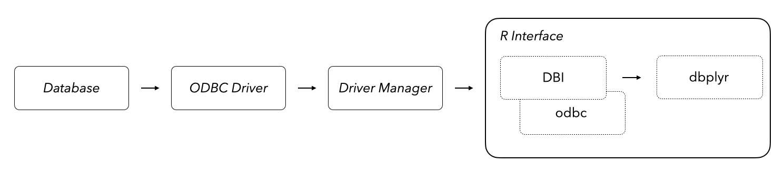

```r
library(RODBC)
library(odbc)
library(DBI)
library(RPostgres)
library(dbplyr)

# Verify the database is reachable
stopifnot(DBI::dbCanConnect(RPostgres::Postgres(),
                            dbname = "ar_db_17",
                            port = 5432,
                            user = Sys.getenv("DB_USER"),
                            password = Sys.getenv("DB_PASSWORD")))

# Define vector of year numbers
years <- c(17:23)

# Create a list of connection objects (one per year)
cons <- purrr::map(years, ~ DBI::dbConnect(RPostgres::Postgres(),
                                           dbname = glue("ar_db_", {.x}),
                                           port = 5432,
                                           user = Sys.getenv("DB_USER"),
                                           password = Sys.getenv("DB_PASSWORD")))

# Define lazy query objects for each year's transactions table
city_trans <- purrr::map(cons, ~ dplyr::tbl(.x, "transactions"))
names(city_trans) <- purrr::map(years, ~ glue::glue("trans_", {.x}))
```

<details>
<summary>Transactions table column reference</summary>

```
 [1] "action_date"
 [2] "awarding_agency_code"
 [3] "awarding_agency_name"
 [4] "federal_action_obligation"
 [5] "primary_place_of_performance_state_name"
 [6] "recipient_name"
 [7] "recipient_uei"
 [8] "usaspending_permalink"
 [9] "generated_pragmatic_obligations"
[10] "action_date_year"
[11] "award_summary_unique_key"
[12] "id"
[13] "contract_award_unique_key"
[14] "contract_transaction_unique_key"
[15] "naics_code"
[16] "naics_description"
[17] "product_or_service_code"
[18] "product_or_service_code_description"
[19] "assistance_award_unique_key"
[20] "assistance_transaction_unique_key"
[21] "assistance_type_code"
[22] "cfda_number"
[23] "cfda_title"
[24] "original_loan_subsidy_cost"
[25] "action_date_year_month"
[26] "prime_award_transaction_place_of_performance_county_fips_code"
```

</details>

---

## Step 2: Identify Recipients

### Overview

Each row of spending data is a transaction from a federal agency to an entity registered on SAM.gov. To track how much the federal government awards to cities, we need to identify which recipients are relevant — specifically, those with addresses within each city's boundaries.

Any recipient of federal funds must register as an "entity" with [SAM.gov](https://sam.gov) and provide basic information. Entities are identified by their Unique Entity Identifier (UEI), assigned by SAM.gov at registration. UEIs serve as a unique key linking SAM.gov entity information (including address) to USA Spending data.

<details>
<summary>Sample SAM.gov entity registration data</summary>

| recipient_uei | recipient_name | phys_address_01 | phys_address_city | phys_address_st | phys_address_ZIP | phys_address_country | entity_structure | bus_type_string |
| --- | --- | --- | --- | --- | --- | --- | --- | --- |
| C111ATT311C8 | K & K CONSTRUCTION SUPPLY INC | 11400 WHITE ROCK RD | RANCHO CORDOVA | CA | 95742 | USA | 2L | 2X~8W~A2~HQ~XS |
| C111BG66D155 | NEW ADVANCES FOR PEOPLE WITH DISABILITIES | 3400 N SILLECT AVE | BAKERSFIELD | CA | 93308 | USA | 8H | A8 |
| C112YNTNMG99 | EATON REGIONAL EDUCATION SERVICE AGENCY | 1790 PACKARD HWY | CHARLOTTE | MI | 48813 | USA | 2A | 12~H6 |

</details>

We'd like to filter all recipients to find just those with addresses that fall within our list of Incorporated Places, which requires a spatial intersection of geocoded addresses with Place boundaries.

<details>
<summary>Why not filter by city name or ZIP code?</summary>

**Why not filter by city name?**

City names in SAM.gov entity registrations are self-reported and are often wrong. Issues include:
- Recipients genuinely unsure of which Incorporated Place they're in (e.g., Tempe vs. Mesa, AZ when they're one street from the boundary)
- Census boundary changes that recipients may not know about
- Typos, inconsistent formatting (e.g., "Winston Salem" vs. "Winston-Salem", "Saint" vs. "St.")

Filtering on these contingencies would be a significant and fragile task.

**Why not filter by ZIP code?**

ZIP codes (ZCTA codes) and Incorporated Places are not 1:1 — a single ZCTA can span multiple Places. ZCTAs can be used for a rough *coarse* filter (see below) but not for precise Place-level filtering.

</details>

To avoid geocoding every recipient (geocoding is slow; reliable geocoding is slow *and* expensive), we first use a ZCTA-to-Place crosswalk from the Census to roughly filter recipients by ZIP code, reducing the geocoding workload to a manageable number. We also restrict to government entities (`entity_structure == "2A"`) at this stage.

> **Note:** In hindsight, filtering by `bus_type_string` containing `12` (U.S. Local Government) at this stage would have further reduced geocoding expense. The decision was made to wait until the transactions step to allow flexibility for different filtering approaches later.

Once we have a list of government recipients within city ZCTAs who also appear in the transactions data, we geocode their addresses and run a spatial intersection to identify which fall within each Incorporated Place boundary.

### Coarse filtering using ZCTA codes

First, acquire all ZCTA codes that encompass the Incorporated Places in the city list.

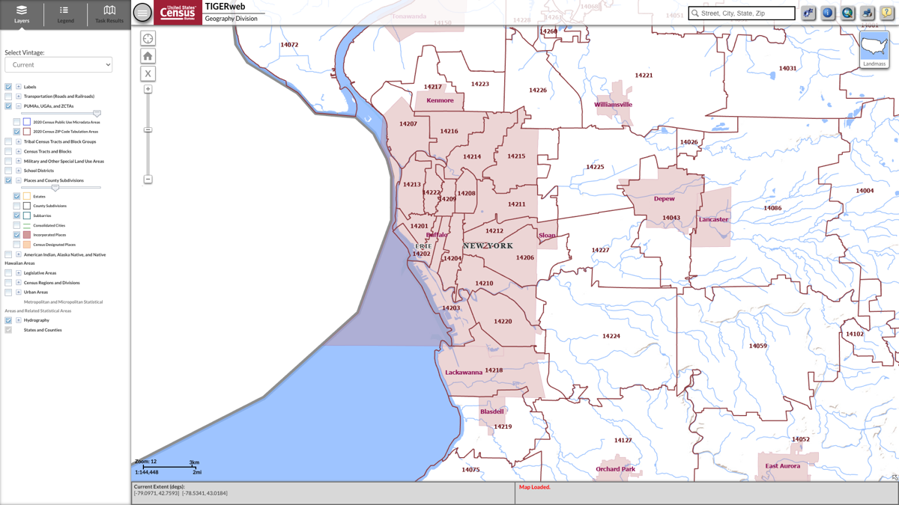

ZCTAs and Incorporated Places are not contiguous (see image above). To capture every recipient within each Place, every ZCTA that *touches* a Place is retained — intentionally resulting in a geographical area slightly larger than each Place. Geocoding in the next steps will refine this to the Place boundaries precisely.

#### Data Import

**City places data** — loaded from the local config file:

```r
city_places <-
  readr::read_csv("./data-raw/city_places.csv",
                  col_select = c(place_id = `SOLE Place ID`,
                                 GEOID_20 = `2020 Census GEOIDs`,
                                 city = `City name`,
                                 state_code = `State Code`,
                                 state = State,
                                 region = `SoLE region`,
                                 pop_21 = `Population 2021`)) |>
  dplyr::mutate(city_label = paste0(city, ", ", state_code), .before = city) |>
  tidyr::separate_longer_delim(GEOID_20, delim = ", ")
```

**ZCTA5-to-Place crosswalk:**

```r
file_zcta_places <- "./data-raw/tab20_zcta520_place20_natl.txt"
zcta520_place20 <- readr::read_delim(file_zcta_places)
```

#### Define ZCTAs that encompass city Incorporated Places

```r
city_zcta_data <-
  zcta520_place20 |>
  dplyr::filter(GEOID_PLACE_20 %in% city_places$GEOID_20) |>
  dplyr::select(GEOID_PLACE_20, NAMELSAD_PLACE_20, GEOID_ZCTA5_20) |>
  tidyr::drop_na(GEOID_ZCTA5_20)
```

Note: because of Incorporated Place proximity, ZCTAs and Places have a many-to-many relationship. A single ZCTA code can fall within multiple Places:

```r
# Example: ZCTA 85282 spans both Mesa and Tempe, AZ
city_zcta_data |>
  dplyr::filter(GEOID_ZCTA5_20 == "85282")
# # A tibble: 2 × 3
#   GEOID_PLACE_20 NAMELSAD_PLACE_20 GEOID_ZCTA5_20
#   <chr>          <chr>             <chr>
# 1 0446000        Mesa city         85282
# 2 0473000        Tempe city        85282
```

### Querying postgres for coarsely-filtered recipients

#### Import SAM.gov entity data

The SAM.gov entity registration file links recipient UEIs in the transactions data to physical addresses. Download and place in `./data-raw/`, then set `file_sam_gov` in `spending-config.R`. A [data dictionary](https://falextracts.s3.amazonaws.com/Data%20Dictionary/Entity%20Information/NOV_2023_Data_Dictionary.pdf) was used to identify column positions.

> **Note:** SAM.gov data is updated monthly. It is recommended to download the latest version when collecting new transaction data.

```r
file_sam_gov <- "./data-raw/SAM_PUBLIC_UTF-8_MONTHLY_V2_20240303.txt"

sam_gov <-
  readr::read_delim(file_sam_gov, delim = "|", col_names = FALSE) |>
  dplyr::select(c("X1","X4","X12","X13","X16","X17","X18","X19",
                  "X20","X21","X22","X23","X27","X28","X31","X32",
                  "X33","X34","X35","X36","X37")) |>
  dplyr::rename(recipient_uei = X1,
                recipient_CAGE = X4,
                recipient_name = X12,
                recipient_dba = X13,
                phys_address_01 = X16,
                phys_address_02 = X17,
                phys_address_city = X18,
                phys_address_st = X19,
                phys_address_ZIP = X20,
                phys_address_ZIP2 = X21,
                phys_address_country = X22,
                phys_address_cong_dist = X23,
                recipient_url = X27,
                entity_structure = X28,
                bus_type_counter = X31,
                bus_type_string = X32,
                primary_NAICS = X33,
                NAICS_code_counter = X34,
                NAICS_code_string = X35,
                PSC_code_counter = X36,
                PSC_code_string = X37)
```

#### Filter SAM.gov to government entities within city ZCTAs

This step restricts recipients to government entities (`entity_structure == "2A"`) in the US with addresses within the coarse ZCTA filter:

```r
recps.2A_zips <-
  sam_gov |>
  dplyr::filter(phys_address_ZIP %in% city_zcta_data$GEOID_ZCTA5_20,
                entity_structure == "2A",
                phys_address_country == "USA") |>
  dplyr::mutate(full_addy = paste0(phys_address_01, " ",
                                   phys_address_02, " ",
                                   phys_address_city, " ",
                                   phys_address_st, " ",
                                   phys_address_ZIP),
                .after = recipient_uei)

# Deduplicate by UEI before geocoding
recps.2A.dist_zips <-
  recps.2A_zips |>
  dplyr::distinct(recipient_uei, .keep_all = TRUE)
```

#### Obtain UEIs present in the transactions database

Cross-reference the ZCTA-filtered recipients against the transactions data to only geocode addresses that actually appear in spending records:

```r
trans_ueis.2A_zips <-
  city_trans |>
  purrr::map(~ dplyr::filter(.x, recipient_uei %in% !!recps.2A.dist_zips$recipient_uei) |>
               dplyr::distinct(recipient_uei) |>
               dplyr::collect())

# Combine all years and get unique UEIs
trans.unq_ueis.2A_zips <-
  trans_ueis.2A_zips |>
  dplyr::bind_rows() |>
  dplyr::distinct(recipient_uei)
```

### Geocoding recipients

#### Get addresses for UEIs found in transactions data

```r
city_trans_addys <-
  recps.2A.dist_zips |>
  dplyr::filter(recipient_uei %in% trans.unq_ueis.2A_zips$recipient_uei) |>
  dplyr::mutate(full_addy = paste0(phys_address_01, " ",
                                   phys_address_02, " ",
                                   phys_address_city, " ",
                                   phys_address_st, " ",
                                   phys_address_ZIP),
                .after = recipient_uei) |>
  dplyr::distinct(full_addy, .keep_all = TRUE)
# ~3,497 unique addresses to geocode
```

#### Geocode using a three-pass approach

Three geocoding services are used in sequence to minimize cost — free services first, paid last:

```r
# Pass 1: Nominatim (free, OSM)
latlong_1 <-
  city_trans_addys |>
  tidygeocoder::geocode(street = phys_address_01,
                        city = phys_address_city,
                        state = phys_address_st,
                        postalcode = phys_address_ZIP,
                        return_addresses = TRUE,
                        method = "osm")
# ~3,497 addresses → ~880 missed

# Pass 2: Geocodio (free tier)
latlong_nas_1 <- latlong_1 |> dplyr::filter(is.na(lat | long))

latlong_2 <-
  city_trans_addys |>
  dplyr::filter(phys_address_01 %in% latlong_nas_1$phys_address_01) |>
  tidygeocoder::geocode(street = phys_address_01,
                        city = phys_address_city,
                        state = phys_address_st,
                        postalcode = phys_address_ZIP,
                        return_addresses = TRUE,
                        method = "geocodio")
# ~880 missed → ~835 found, ~45 remaining

# Pass 3: Google Maps (paid; requires GOOGLE_MAPS_KEY env var)
latlong_nas_2 <- latlong_2 |> dplyr::filter(is.na(lat | long))

ggmap::register_google(key = Sys.getenv("GOOGLE_MAPS_KEY"), write = TRUE)

latlong_3 <-
  city_trans_addys |>
  dplyr::filter(phys_address_01 %in% latlong_nas_2$phys_address_01) |>
  dplyr::mutate(full_address = paste0(phys_address_01, ", ",
                                      phys_address_city, ", ",
                                      phys_address_st, ", ",
                                      phys_address_ZIP)) |>
  ggmap::mutate_geocode(full_address) |>
  dplyr::rename(long = lon)
```

Bind results and save to avoid re-geocoding:

```r
latlong <-
  latlong_1 |>
  dplyr::filter(!is.na(lat)) |>
  dplyr::bind_rows(latlong_2 |> dplyr::filter(!is.na(lat))) |>
  dplyr::bind_rows(latlong_3 |> dplyr::filter(!is.na(lat))) |>
  dplyr::filter(phys_address_country == "USA") |>
  dplyr::select(-c("full_address"))

readr::write_csv(latlong, "./data-processed/latlong_240312.csv")
```

### Fine-filtering using Place geometries

Import 2020 Census-defined Incorporated Place polygon geometries and combine with city metadata:

```r
geojson_path <- "<path-to-city-boundary-geojson-files>"
files_geojson <- list.files(path = geojson_path, pattern = "*.geojson", full.names = TRUE)

city_geoms <-
  purrr::map(files_geojson, ~ geojsonsf::geojson_sf(.x)) |>
  dplyr::bind_rows() |>
  sf::st_transform(crs = "EPSG:4269") |>
  dplyr::rename(`Place ID` = place_id) |>
  dplyr::left_join(city_places) |>
  dplyr::rename(GEOID_PLACE_20 = `2020 Census GEOIDs`)
```

Convert geocoded addresses to an SF object and intersect with Place geometries:

```r
latlong_sf <-
  latlong |>
  sf::st_as_sf(coords = c("long", "lat"), crs = "EPSG:4326") |>
  sf::st_transform(crs = sf::st_crs(city_geoms))

intersects <- sf::st_intersects(city_geoms$geometry, latlong_sf$geometry, sparse = FALSE)
latlong_sf_any <- latlong_sf[apply(intersects, 2, any),]
```

Verify results visually using `plotCity()` (see `./r-delivery/spending-figures_plotCity.R`):

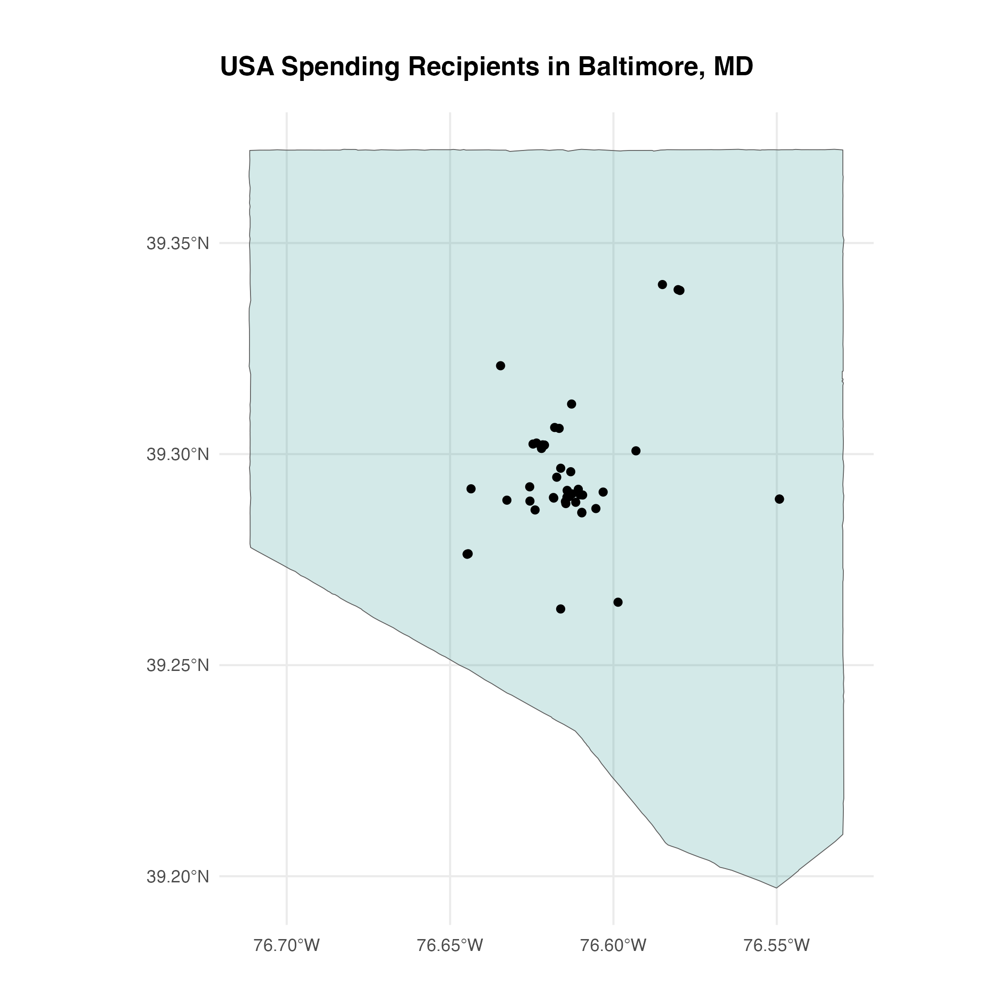

Define the final list of recipient UEIs within city boundaries:

```r
city_ueis <-
  latlong_sf_any |>
  dplyr::distinct(recipient_uei) |>
  dplyr::pull(recipient_uei)
```

---

## Step 3: Collect Transactions

### Overview

With all recipients identified within city geographies, their transactions are pulled from the PostgreSQL databases, merged with SAM.gov metadata, and organized by fiscal year.

### Collect all transactions for filtered recipients

```r
city_trans_all <-
  city_trans |>
  purrr::map(~ dplyr::filter(.x, recipient_uei %in% !!city_ueis) |>
               dplyr::collect())

city_trans_full <-
  city_trans_all |>
  dplyr::bind_rows()

readr::write_csv(city_trans_full, "./data-processed/city_transactions.csv")
```

### Add SAM.gov metadata and define fiscal years

Fiscal year is not natively included in the data and must be derived from `action_date_year_month`:

```r
city_trans_2 <-
  city_trans_full |>
  dplyr::left_join(city_labels_2, by = "recipient_uei") |>
  dplyr::mutate(FY = dplyr::case_when(
    action_date_year_month >= "2016-10" & action_date_year_month <= "2017-9" ~ "2017",
    action_date_year_month >= "2017-10" & action_date_year_month <= "2018-9" ~ "2018",
    action_date_year_month >= "2018-10" & action_date_year_month <= "2019-9" ~ "2019",
    action_date_year_month >= "2019-10" & action_date_year_month <= "2020-9" ~ "2020",
    action_date_year_month >= "2020-10" & action_date_year_month <= "2021-9" ~ "2021",
    action_date_year_month >= "2021-10" & action_date_year_month <= "2022-9" ~ "2022",
    action_date_year_month >= "2022-10" & action_date_year_month <= "2023-9" ~ "2023"),
    .after = action_date)

city_trans_3 <-
  city_trans_2 |>
  dplyr::left_join(sam_gov |>
                     dplyr::select(recipient_uei, entity_structure, bus_type_counter,
                                   bus_type_string, primary_NAICS, NAICS_code_counter,
                                   NAICS_code_string, PSC_code_counter, PSC_code_string),
                   by = "recipient_uei")
```

---

## Step 4: Filter Recipients and Transactions

### Filter by business type

At this point we have all transactions for government entities inside of city Places, but many recipients do not represent city governments. Using SAM.gov metadata, we apply further filtering.

Recipients registered as government agencies (`entity_structure == "2A"`) may select from `bus_type_string` options to refine their entity type. If the entity is a government agency, one of the following business type codes must be selected:

| Code | Name |
| --- | --- |
| 2R | U.S. Federal Government |
| 2F | U.S. State Government |
| 12 | U.S. Local Government |
| 3I | Tribal Government |
| CY | Foreign Government |

Business type strings follow a `~`-delimited format (e.g., `12~C6~C8~MG`). To capture all local governments regardless of additional sub-types selected, a `grepl` filter is used:

```r
city_trans_sam.12 <-
  city_trans_sam |>
  dplyr::filter(grepl('12', bus_type_string))
```

This crude filter leaves many recipients that do not represent city governments. Filtering by `recipient_name` containing "CITY" or "MUNICIPAL" reveals the problem:

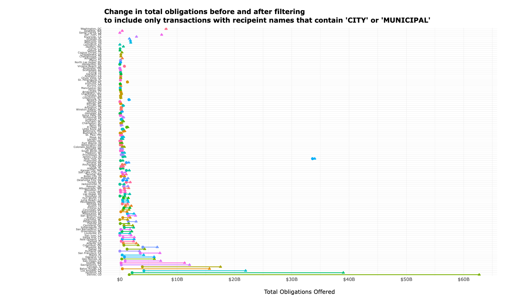

Most cities are not hugely impacted, but 11 cities see differences over $5B — and Denver shows a $60B difference. The bulk of Denver's excluded transactions are from the Colorado Department of Human Services, which reports as both a state and local government entity.

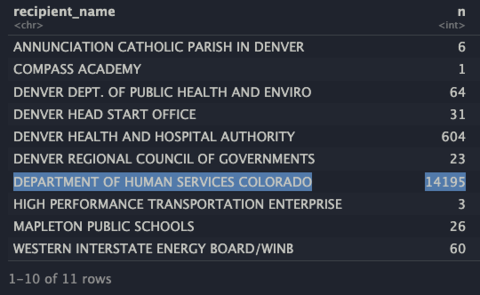

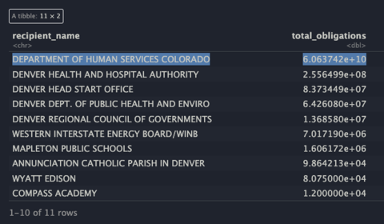

Beyond state agencies, many recipients reporting as local governments are also reporting as county or state governments, and some private universities in major cities (e.g., University of Washington) identify as both local governments and State Controlled Institutions of Higher Learning.

The filtering strategy: exclude recipients who report `bus_type_code = 12` but **also** report any of the following:

| Code | Name |
| --- | --- |
| C7 | County |
| 2F | U.S. State Government |
| OH | State Controlled Institution of Higher Learning |

```r
exclude.codes <- c("C7", "2F", "OH")

city_trans_sam.12.ex <-
  city_trans_sam.12 |>
  dplyr::filter(!grepl(paste(exclude.codes, collapse = '|'), bus_type_string))
```

This filter excludes some recipients that *do* represent city governments — specifically, [cities that are also counties](https://www.wikiwand.com/en/Consolidated_city-county). To recover these false negatives, recipients excluded by the above filter are inspected for those that:

- Do **not** include the `OH` code (capturing city/county governments, not higher ed), **and**
- Have `recipient_name` containing "CITY" or "MUNICIPAL"

```r
city_trans_sam.12.ex.fneg <-
  city_trans_sam.12 |>
  dplyr::mutate(names = purrr::map_chr(bus_type_string, ~ replace_codes(.x, df.bus_types)),
                .after = recipient_name) |>
  dplyr::filter(grepl(paste(exclude.codes, collapse = '|'), bus_type_string)) |>
  dplyr::filter(!grepl("OH", bus_type_string)) |>
  dplyr::filter(grepl("(?=.*City)(?=.*County)", names, ignore.case = TRUE, perl = TRUE)) |>
  dplyr::filter(!recipient_uei %in% blacklist)

city_trans_sam.12.ex.pb <-
  city_trans_sam.12.ex |>
  dplyr::bind_rows(city_trans_sam.12.ex.fneg)
```

A manually constructed blacklist removes true negatives that passed the false-negative filter:

<details>
<summary>Recipient blacklist</summary>

```r
blacklist <-
  c("EG8WAM315LZ5", # HOUSING AUTHORITY OF THE COUNTY OF KERN; Bakersfield, CA
    "T81MLLAMG4K9", # OKLAHOMA, COUNTY OF
    "KRN3EHZL2VC3", # WICHITA AREA METROPOLITAN PLANNING ORGANIZATION
    "EP6MLJ21L3G3", # ELECTRICAL SYSTEMS INC, Wichita, KS
    "DTNMMPBN5715", # SANTA CLARA CNTY HOUSING AUTH
    "WVPXXNGJHNN5", # SOUTHERN CALIFORNIA INTERGOVERNMENTAL TRAINING & DEVELOPMENT CENTER
    "MLB7RPN9DK25", # UTAH PERFORMING ARTS CENTER AGENCY
    "W8S7DA41BTV3", # SOUTHEAST NEBRASKA DEVELOPMENT DISTRICT
    "C8F3CY5MLJE8", # JACKSON HINDS LIBRARY SYSTEM
    "Y6DVFRLRR2D7", # HUNTSVILLE-MADISON COUNTY AIRPORT AUTHORITY
    "CDEZZSTCZTR5", # METROPOLITAN TRANSIT AUTHORITY OF HARRIS COUNTY; Houston, TX
    "L666V7ZW6CG3", # COLUMBUS-FRANKLIN COUNTY FINANCE AUTHORITY
    "Z3LULQHD94B9", # CUYAHOGA COUNTY LAND REUTILIZATION CORPORATION
    "GGZZKEZLFZT1", # NATIVE AMERICAN INDIAN CENTER OF CENTRAL OHIO
    "ND9STDVJND49", # ILLINOIS DEPARTMENT OF EMPLOYMENT SECURITY
    "MUP2NS4H1MV7", # IL PUBLIC SAFETY AGENCY NETWORK
    "GVC3E8KNC8N3", # CHATTANOOGA - HAMILTON COUNTY AIR POLLUTION CONTROL BUREAU
    "C234L4APDQ89", # WEST VIRGINIA STATE AUDITORS OFFICE
    "GJ14HLKXRNR5"  # YELLOWSTONE CITY-COUNTY HEALTH
  )
```

</details>

> **Caveat:** The filters and manual blacklist introduce sampling bias, as they are limited to recipients who chose to identify many `bus_type_codes`. Recipients who only identified `2A` and `12` are subject to neither the filtering constraints nor the blacklist search, meaning some transactions may over-represent true city government spending. If the practice of listing many codes is specific to some cities due to policy or culture, this overrepresentation may not be distributed evenly.

### Filter by place of performance

Filtering solely by recipient address can produce false positives — a recipient headquartered in a city may receive federal awards for work performed entirely elsewhere. The `primary_place_of_performance_state_name` field is used as an additional filter, removing transactions where the place of performance state does not match the recipient's registered state.

Zero-value transactions are also removed at this step.

```r
city_trans_sam.12.ex.pb.pp <-
  city_trans_sam.12.ex.pb |>
  dplyr::filter(federal_action_obligation != 0) |>
  dplyr::inner_join(city_places |>
                      dplyr::select(GEOID_20, state, state_code) |>
                      dplyr::mutate(state = stringr::str_to_upper(state)),
                    by = dplyr::join_by(GEOID_20)) |>
  dplyr::filter(primary_place_of_performance_state_name == state |
                  primary_place_of_performance_state_name == state_code |
                  is.na(primary_place_of_performance_state_name)) |>
  dplyr::mutate(FY = as.numeric(FY))
```

---

## Step 5: Handle Deobligations

The data obtained and displayed represents federal **obligation** data — promises made by the federal government to spend money — rather than outlay data (what is actually disbursed). Outlay data was not required for reporting until ~2022, making a meaningful timeline impossible with outlays alone.

Transactions may be obligations (positive values) or **deobligations** (negative values — account balance adjustments). The problem: displaying a year with a negative total spending value would be confusing to an audience without detailed context.

> **Note:** This plot shows transactions at a month-level summary, produced before business type filtering was finalized. The main point about deobligations remains relevant. Cities like Sacramento and Minneapolis show large deobligations.

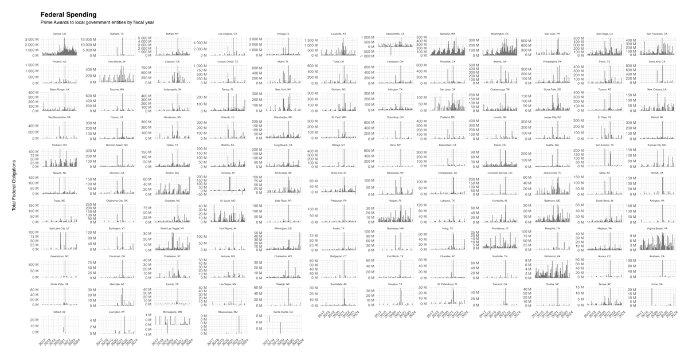

An additional constraint is data quality: USA Spending data prior to FY2017 is unreliable, so transactions were limited to FY2017 and beyond. Awards can span multiple years, so this cutoff means that for awards starting before 2017, only a portion of transactions are captured. If an obligation was made in 2016 and a deobligation recorded in 2019, only the deobligation appears in the data.

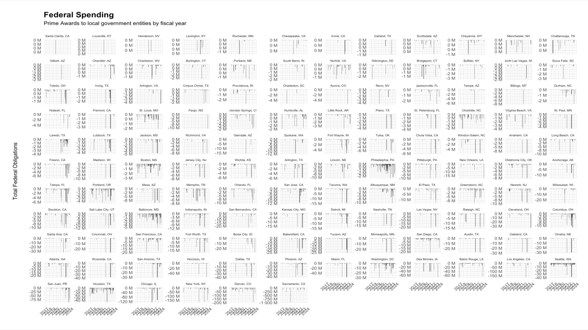

### Deobligation spreading strategy

Deobligations are spread evenly across the years an award was active to approximate outlay behavior. Awards in the data manifest in two distinct forms:

**Case 1: Awards with deobligations only (no obligations captured)**

Assumed to represent awards that started prior to 2017. The total deobligation sum is divided by the number of years the award is active in the data (from 2017 to the year of the last transaction), and that amount is subtracted from each year.

> *Example:* An award with deobligations of -$100k (2018) and -$500k (2022) only → total -$600k divided evenly across 6 years (2017–2022) → -$100k subtracted from each year.

**Case 2: Awards with both obligations and deobligations**

The total deobligation sum is divided by the number of years that contained obligations, and that amount is subtracted from each obligation year.

> *Example:* An award with obligations of $800k (2017) and $200k (2020), and deobligations of -$300k (2019) and -$200k (2023) → total -$500k divided by 2 obligation years → -$250k subtracted from 2017 ($800k → $550k) and 2020 ($200k → -$50k).

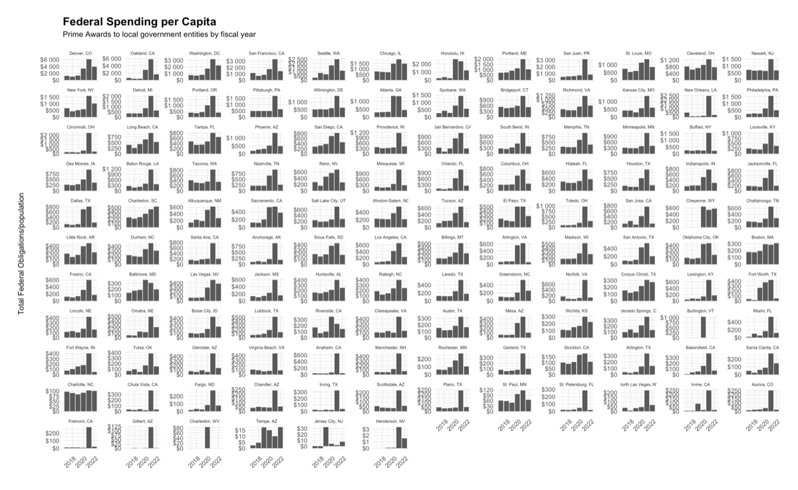

Three city/years (Jersey City, NJ 2018 & 2020; Henderson, NV 2022) remained negative after spreading. These are set to NA for display until a better solution is determined.

The full deobligation spreading implementation is in `./r-delivery/spending-deobligations.R`.

---

## Step 6: Summarize and Output

### Summarize spending by city and fiscal year

```r
city_trans_filtered |>
  dplyr::group_by(place_id, FY) |>
  dplyr::summarise(total_obligations = sum(federal_action_obligation)) |>
  dplyr::select(FY, total_obligations, place_id) |>
  dplyr::mutate(category_id = rep("", length(FY)),
                FY = paste0(FY, "-01-01 00:00:00")) |>
  dplyr::rename(value = total_obligations,
                date = FY) |>
  readr::write_csv(glue::glue("data-delivery/city-federal-spending_{Sys.Date()}.csv"))
```

Example output:

| place_id | value | date | category_id |
| --- | --- | --- | --- |
| c-pr--sju | $192,254,719.39 | 2017-01-01 00:00:00 | |
| c-pr--sju | $188,656,198.10 | 2018-01-01 00:00:00 | |
| c-us-ak-anc | $29,752,059.88 | 2017-01-01 00:00:00 | |
| c-us-ak-anc | $38,913,240.05 | 2018-01-01 00:00:00 | |

### Produce visualizations

Plots are generated using `./r-delivery/spending-figures_plotSpending.R` (only runs in interactive mode):

```r
if (interactive()) {
  source("./r-delivery/spending-figures_plotSpending.R")
}
```

Example outputs:

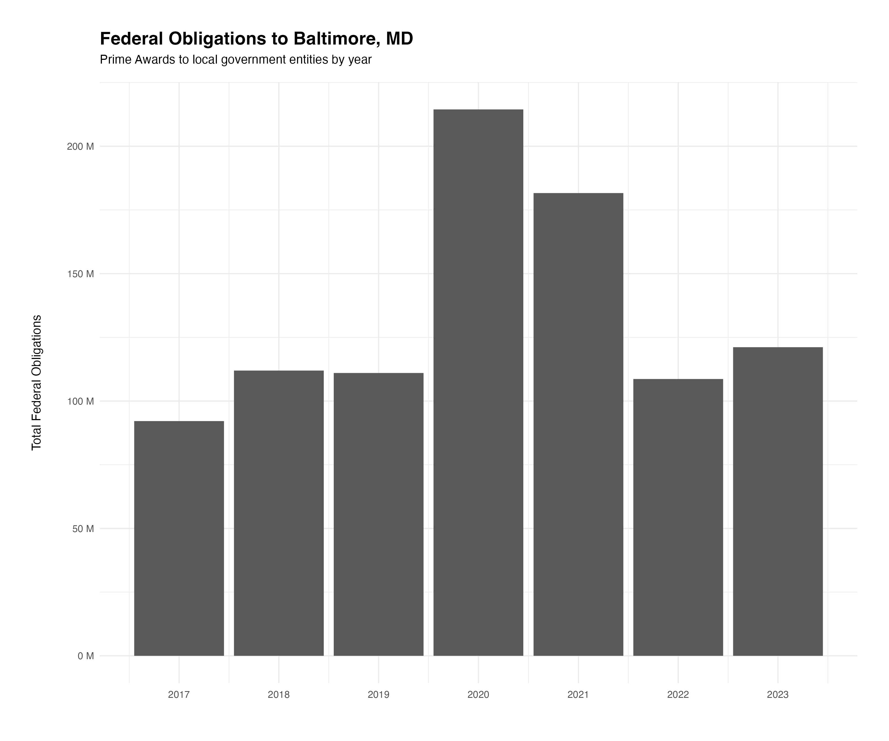

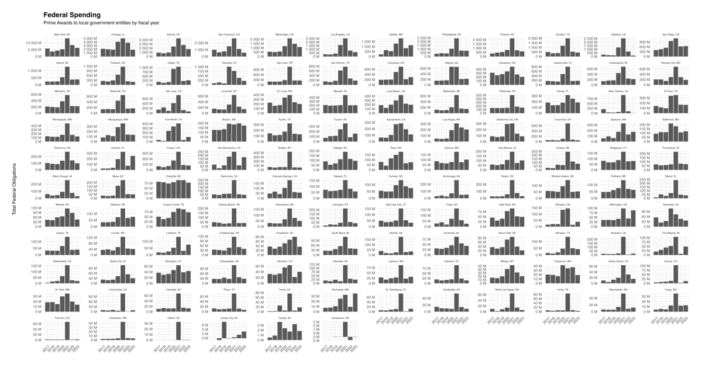

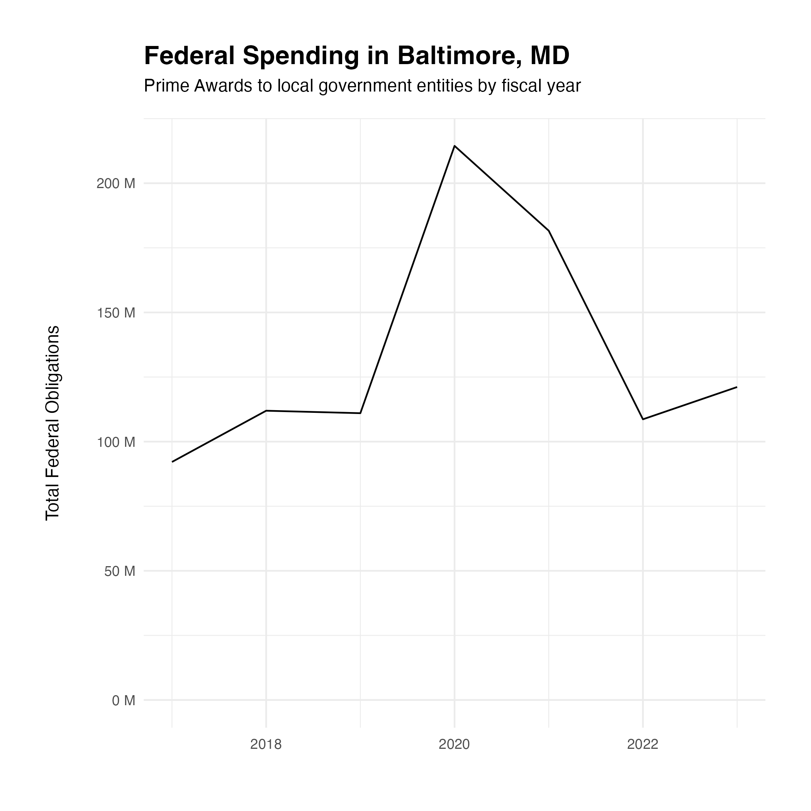

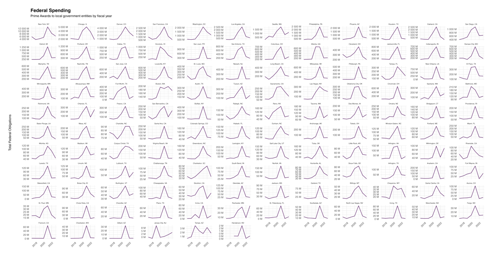
